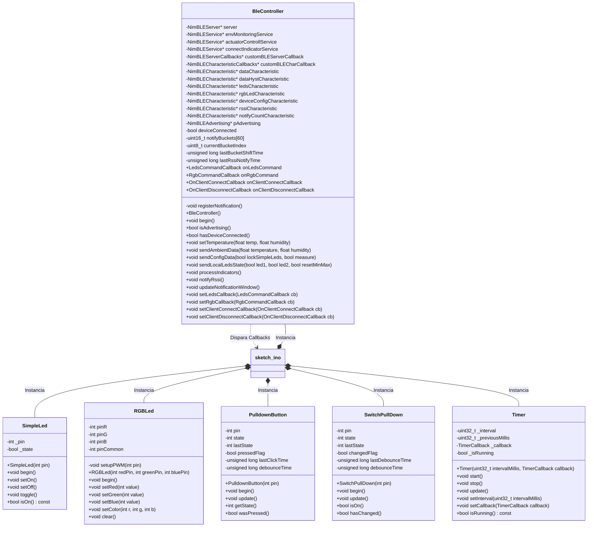
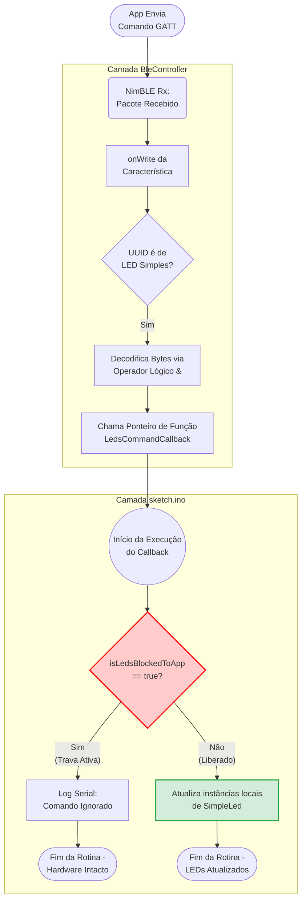

# Monitoramento de temperatura, umidade e controle de atuadores com ESP 32 e BLE

---

## 1. Introdução

Esta documentação detalha o desenvolvimento e as decisões arquiteturais de um sistema embarcado completo, focado em monitoramento ambiental e controle de atuadores via *Bluetooth Low Energy* (BLE). Desenvolvido como requisito parcial para aprovação na disciplina de Sistemas Embarcados e IOT do bacharelado em Ciência da Computação da Universidade Federal da Fronteira Sul (UFFS), o projeto integra um firmware operando em um microcontrolador ESP32 e um aplicativo móvel construído com o framework Flutter.

O principal objetivo das aplicações é demonstrar a implementação de uma comunicação sem fio eficiente e segura entre dispositivos, explorando o gerenciamento do ciclo de vida da conexão BLE, técnicas de empacotamento binário de dados para economia de banda e o estabelecimento de vínculos seguros por meio de pareamento autenticado (MITM/Passkey).

Nas seções a seguir, a documentação está organizada para guiar o leitor através de todas as camadas das aplicações, detalhando a configuração do hardware, a lógica assíncrona do firmware, a modelagem do perfil GATT customizado e as soluções de interface adotadas no aplicativo cliente.

O repositório do projeto está estruturado da seguinte maneira:

```
📦 raiz-do-repositorio
 ┣ 📂 bin/
 ┃ ┗ 📜 app-release.apk                   # Arquivo binário gerado para instalação no Android
 ┣ 📂 docs/                               # Documentação exigida pelo trabalho
 ┃ ┗ 📜 README.md                         # Documentação principal do projeto
 ┣ 📂 /apk/lib/                           # Código-fonte do aplicativo mobile (Flutter)
 ┃ ┣ 📂 screens/
 ┃ ┃ ┣ 📜 connection_metrics_section.dart # Painel de métricas de conexão, RSSI e contador de pacotes
 ┃ ┃ ┣ 📜 connection_screen.dart          # Tela de escaneamento BLE e pareamento seguro
 ┃ ┃ ┣ 📜 control_section.dart            # Painel de atuação (UX reativa para Leds Simples e RGB)
 ┃ ┃ ┣ 📜 dashboard_screen.dart           # Orquestrador de navegação, reconexão e ciclo de vida
 ┃ ┃ ┗ 📜 monitoring_section.dart         # Painel de gráficos e plotagem do histórico DHT22
 ┃ ┗ 📜 main.dart                         # Ponto de entrada e configuração do tema do aplicativo
 ┣ 📂 sketch/                             # Código-fonte do firmware embarcado (ESP32 / C++)
 ┃ ┣ 📜 BleController.cpp                 # Implementação das regras GATT, callbacks e segurança
 ┃ ┣ 📜 BleController.h                   # Header do controlador Bluetooth (NimBLE)
 ┃ ┣ 📜 PulldownButton.cpp                # Implementação de debounce e leitura para push-buttons
 ┃ ┣ 📜 PulldownButton.h                  # Header da classe de botões físicos
 ┃ ┣ 📜 RGBLed.cpp                        # Implementação das operações via PWM (ledc)
 ┃ ┣ 📜 RGBLed.h                          # Header do controlador do LED RGB
 ┃ ┣ 📜 SimpleLed.cpp                     # Implementação de métodos de toggle e estados lógicos
 ┃ ┣ 📜 SimpleLed.h                       # Header da classe de abstração de LEDs básicos
 ┃ ┣ 📜 SwitchPullDown.cpp                # Implementação do tratamento contínuo de switches
 ┃ ┣ 📜 SwitchPullDown.h                  # Header da classe de leitura de chaves estáticas
 ┃ ┣ 📜 Timer.cpp                         # Implementação da rotina não-bloqueante para tarefas
 ┃ ┣ 📜 Timer.h                           # Header do controlador de tempo via millis()
 ┃ ┗ 📜 sketch.ino                        # Arquivo principal (Máquina de estados, LCD e Orquestrador)
 ┗ 📜 README.md                           # Requisitos do projeto
```

---
## 2. Visão geral do projeto

Este projeto propõe uma solução bidirecional de telemetria e controle baseada no protocolo *Bluetooth Low Energy* (BLE). A arquitetura integra um dispositivo embarcado (ESP32 atuando como Servidor GATT) e um aplicativo móvel (Cliente Central desenvolvido em Flutter), estabelecendo uma interface fluida e de baixa latência entre hardware e software.

O sistema foi desenvolvido para monitorar variáveis ambientais em tempo real, acionar atuadores físicos e monitorar a qualidade da conexão sem fio. O diferencial da implementação reside no foco em eficiência energética e responsividade, empregando estratégias de compactação de dados e segurança contra acessos não autorizados.

### 2.1. Arquitetura do Firmware (ESP32)

O firmware foi desenvolvido em C++ sob paradigma misto entre Orientação a Objetos e estruturado, utilizando a biblioteca `NimBLE-Arduino`. A arquitetura de software opera de forma totalmente não-bloqueante por meio da delegação de temporizadores para o laço de execução principal. 

O dispositivo opera tanto de forma autónoma (Modo Local) como subordinada (Modo Remoto), e inclui as seguintes funcionalidades:

- **Monitoramento**: Leitura contínua de temperatura e umidade através de um sensor DHT22.
- **Atuadores**: Controle de acionamento de dois LEDs simples e de um LED RGB (PWM).
- **Interface Física**: Display LCD I2C (16x2) gerido por uma máquina de estados finitos (FSM) para navegação de dados, além de botões e switches físicos (pull-down) para comandos locais.
- **Trava de Hardware (Security Lock)**: Uma trava a nível do hardware que permite a um operador físico bloquear qualquer comando vindo da aplicação móvel e assumir o controle dos atuadores.

O dispositivo possui dupla modalidade de operação (Local e Remota), e implementa as capacidades descritas a seguir:
- **Sensoriamento Ambiental**: Coleta de temperatura e umidade através do sensor DHT22.
- **Atuação Dinâmica**: Controle independente de LEDs simples e modulação de largura de pulso (PWM) para transições de cores em um LED RGB.
- **Interface Física e Navegação**: Um display LCD (16x2) gerido por uma Máquina de Estados Finitos (FSM) para apresentação dos dados e diagnósticos do sistema. A interação local ocorre por meio de botões (push-buttons com tratamento de debounce) e chaves estáticas (pull-down).
- **Trava de Segurança**: Um mecanismo físico que permite ao operador local bloquear os controles do aplicativo móvel, isolando o dispositivo contra comandos externos e assumindo localmente o controle dos via chaves estáticas.

O diagrama abaixo apresenta a estrutura das classes utilizadas no firmware.



Detalhes de implementação serão apresentados na seção [Descrição do Firmware](#3-descrição-do-firmware).


### 2.2. Arquitetura de Software (Aplicação Móvel)

O cliente móvel, construído sobre o framework Flutter (Dart), atua como controlador de comando e telemetria do sistema. A interface do usuário é dividida em três telas primárias:

- **Monitoramento Ambiental**: Renderização de gráficos históricos contínuos e displays numéricos dinâmicos para o acompanhamento da temperatura e umidade em tempo real.

- **Painel de Controle**: Tela para acionamento dos LEDs e seleção de cores RGB (via espectro HSV). Para garantir a consistência dos estados, a interface reage ativamente à Trava de Segurança do ESP32: se o bloqueio físico for ativado na protoboard, o aplicativo desabilita visual e logicamente seus controles, informando ao usuário que o hardware está operando em Modo Local.

- **Métricas de Conexão**: Monitoramento da camada de rede através da plotagem em tempo real da força do sinal de rádio (RSSI em dBm) e da contagem de notificações enviadas pelo hardware no último minuto.

A ponte de comunicação entre essas duas pontas ocorre exclusivamente via BLE, adotando um perfil GATT personalizado. O tráfego de rede é minimizado pelo uso intensivo de operações lógicas (*bitwise*) e estruturas de dados compactadas (*payloads* binários de tamanho fixo), o que viabiliza tempos de resposta mínimos.

Nas seções seguintes, as lógicas de implementação do firmware e do aplicativo são detalhadas, acompanhadas de diagramas de arquitetura e fluxogramas de execução.


---
## 3. Descrição do Firmware
A base de código do ESP32 foi desenvolvida inteiramente em C++, tendo a biblioteca otimizada `NimBLE-Arduino` como núcleo para a comunicação Bluetooth. Para evitar a criação de um script monolítico e difícil de manter, a arquitetura foi desenhada pensando na separação de responsabilidades.


### 3.1. Encapsulamento e Modularidade
Para garantir a manutenibilidade e evitar o acoplamento excessivo, as lógicas de controle de hardware e os detalhes do protocolo foram abstraídos em classes específicas. Essas classes encapsulam a complexidade, entregando métodos limpos para serem utilizados no arquivo raiz (`sketch.ino`). As abstrações implementadas incluem:
- **Bluetooth** (`BleController`): Centraliza a configuração do servidor *NimBLE*, controle de serviços, características (GATT), gerenciamento de segurança e notificações do protocolo BLE.
- **Botões** (`PulldownButton`): Implementa a leitura de botões do tipo *push-button* sob lógica *pull-down*, incorporando internamente o tratamento de *debounce* (ruído de contato) através da verificação de tempo via `millis()`.
- **Switches** (`SwitchPullDown`): Semelhante aos botões, mas focado no monitoramento de chaves estáticas de dois estados, levantando sinalizadores (*flags*) de mudança de estado de forma confiável.
- led RGB (`RGBLed`): Abstrai a complexidade do controle PWM no ESP32 (utilizando a API `ledc`), permitindo o ajuste de cor direta através de parâmetros RGB de 0 a 255 via chamada `void setColor(int r, int g, int b);` . 
- **Leds** (`SimpleLed`): Simplifica a operação de pinos digitais de saída, abstraindo diretrizes como `pinMode` e `digitalWrite` em métodos literais como `setOn()` e `toggle()`. 
- **Temporização** (`Timer`): Classe dedicada à execução de lógicas não-bloqueantes. Recebe um intervalo em milissegundos e um ponteiro de função (*callback*), acionando-o automaticamente apenas quando o tempo estipulado é alcançado. Internamente, previne problemas de *drift* (desvio de sincronia) e o estouro (*overflow*) do registrador interno de tempo do microcontrolador.


Dessa forma, o arquivo principal (`sketch.ino`) atua como uma máquina de estados e orquestrador geral do sistema. Sua função resume-se a instanciar os controladores, registrar os *callbacks* e processar o laço principal de execução (`loop`) chamando exclusivamente os métodos de atualização (`.update()`) de cada instância. Isso isola as regras de negócio de alto nível das complexidades físicas do hardware.


### 3.2. Bluetooth: Inicialização, Segurança e Advertising

A rotina de inicialização da camada Bluetooth foi projetada de forma personalizada para conciliar segurança, economia de energia no estado de espera e alta responsividade após o estabelecimento do vínculo (*handshake*). Toda essa gerência é concentrada no método `begin()` da classe `BleController`.

O fluxo operacional e suas respectivas justificativas técnicas são divididos em quatro etapas consecutivas:


#### 3.2.1. Inicialização da Pilha BLE e Expansão de MTU
O ciclo se inicia com a chamada de baixo nível `NimBLEDevice::init()`, que nomeia o dispositivo com o nome configurado na constante `BLE_NAME_ADVERTISING` (definido como "ESP32_NimBLE_Eduardo").

Imediatamente após subir a pilha de rádio, o firmware executa uma otimização de infraestrutura por meio do comando `NimBLEDevice::setMTU(512)`. Por padrão, o protocolo BLE utiliza uma Unidade Máxima de Transmissão (MTU) de apenas 23 bytes, o que fragmentaria pacotes maiores. Ao expandir o teto do MTU para 512 bytes, o ESP32 ganha a capacidade de trafegar arrays densos de dados (como o descarregamento de buffers históricos) em um único ciclo de transmissão, reduzindo o processamento e o tempo de rádio ativo.

#### 3.2.2. Configuração de Segurança e Pareamento Autenticado
Para impedir que usuários não autorizados interceptem a telemetria ou enviem comandos maliciosos aos atuadores, o sistema implementa segurança estrita baseada em criptografia com autenticação e proteção contra ataques de personificação (*Man-In-The-Middle* - MITM).

```c++
NimBLEDevice::setSecurityAuth(true, true, true); // Bonding + MITM + Secure Connections
NimBLEDevice::setSecurityPasskey(BLE_PASSWORD);
NimBLEDevice::setSecurityIOCap(BLE_HS_IO_DISPLAY_ONLY);
```

A função `setSecurityAuth` ativa os sinalizadores de *Bonding* (armazenamento seguro do vínculo no chip), proteção MITM e conexões seguras nativas.

Ao definir a propriedade de Input/Output como `BLE_HS_IO_DISPLAY_ONLY`, o sistema operacional do celular (Android) é forçado a interceptar o fluxo de conexão e abrir uma caixa de diálogo nativa exigindo que o usuário digite o código estático de 6 dígitos configurado em `BLE_PASSWORD` (ex: 666123). Sem essa senha, a chave de criptografia de curto prazo não é gerada e a conexão é rejeitada pela camada de pareamento do hardware.


#### 3.2.3. Estratégia de Anúncio (Advertising e Scan Response)
Com a pilha e a segurança prontas, o firmware configura o objeto `NimBLEAdvertising` para transmitir a presença do dispositivo. Para reduzir o consumo de energia enquanto o ESP32 aguarda conexões, a frequência de emissão dos pacotes de anúncio foi fixada em 400 ms (`BLE_ADVERTISING_INTERVAL`).

Para otimizar o tamanho do pacote principal de anúncio, a arquitetura do firmware adota uma estratégia de divisão de carga útil:

- **Pacote de Anúncio Principal (`advData`)**: Contém os sinalizadores básicos de descoberta (`setFlags(0x06)`) e anuncia apenas o UUID curto de 16 bits do Serviço Ambiental (`0x181A`).

- **Pacote de Resposta de Escaneamento (`scanRespData`)**: O nome completo do dispositivo (`BLE_NAME_ADVERTISING`) e o UUID customizado de 128 bits do Serviço de Controle de Atuadores são alocados no buffer de *Scan Response*. Esse pacote complementar só é transmitido via rádio se o smartphone solicitar ativamente informações adicionais durante a varredura, poupando energia e banda do microcontrolador.


#### 3.2.4. Negociação Dinâmica dos Parâmetros de Conexão
Os parâmetros de rádio padrão estipulados pelos sistemas operacionais móveis priorizam economia de bateria, resultando em latências altas (frequentemente acima de 200 ms por transmissão). Como o projeto exige respostas rápidas aos comandos, o firmware implementa uma renegociação forçada assim que o *handshake* é bem-sucedido.

Dentro do evento assíncrono `onConnect` do servidor, o ESP32 intercepta a conexão e dispara uma requisição de atualização de parâmetros (`updateConnParams`) diretamente para o identificador do cliente conectado (*connection handle*), que faz as seguintes modificações:

- **Intervalo Mínimo e Máximo de Conexão (`BLE_MIN_CONNECT_INTERVAL` e `BLE_MAX_CONNECT_INTERVAL`)**: Fixados entre 50 ms e 100 ms para forçar o rádio do celular a conversar com o ESP32 em uma janela de tempo estreita, garantindo taxas de atualização altas para as plotagens e comandos.

- **Latência Escrava (`BLE_SLAVE_LATENCI`)**: Definida como 0 para indicar ao ESP32 que não deve ignorar nenhum evento de chamada do celular, respondendo imediatamente a qualquer chamada na interface móvel.

- **Timeout de Supervisão (`BLE_SUPERVISION_TIMEOUT`)**: Fixado em 2000 ms (2 segundos). Caso o smartphone se afaste ou sofra uma queda abrupta de energia, o hardware do ESP32 aguarda no máximo 2 segundos antes de fechar a conexão, os canais abertos e reativar o modo de anúncio via rádio.


Todas as constantes, UUIDs e senhas de configuração do BLE estão centralizados no arquivo de cabeçalho `BleController.h`.


### 3.3. Arquitetura do Perfil GATT (Serviços e Características)

A comunicação entre o microcontrolador ESP32 (Servidor) e o aplicativo mobile (Cliente) é estruturada sobre o protocolo BLE (*Bluetooth Low Energy*) utilizando o perfil genérico de atributos (GATT). 

Para otimizar o envio de dados e separar logicamente as responsabilidades do sistema, foram definidos três serviços principais contendo suas respectivas características.

Abaixo, é descrita a tabela GATT completa utilizada para comunicação entre aplicações:

| Serviço (UUID) | Característica (UUID) | Propriedades | Descrição do Payload e Funcionamento |
| :--- | :--- | :--- | :--- |
| **Serviço Ambiental**<br>`0x181A`<br>*(Standard Env Sensing)* | **Dados Atuais**<br>`f52de2f0-5d97-42f3-933f-6b299132861d` | `Read`, `Notify` | Envia um pacote binário otimizado de 6 bytes (`EnvDataPayload`) contendo: <br>- *Bytes 0-1*: Temp. Celsius (`int16_t`)<br>- *Bytes 2-3*: Temp. Fahrenheit (`int16_t`)<br>- *Bytes 4-5*: Umidade (`uint16_t`)<br>O App divide os valores por 100 para restaurar as casas decimais. |
| | **Gráfico Histórico**<br>`614e74cf-1814-45fc-8602-3263376705e3` | `Read` | Interface de leitura para que o cliente realize o download (Read Request) de pacotes com dados históricos retidos na memória do ESP32. |
| **Controle de Atuadores**<br>`d6ca719a-7ae1-485a-bf63-ac03fdf84527`<br>*(Customizado 128-bits)* | **LEDs Simples**<br>`1384d4f8-05b5-4d0e-8d4b-ecfa8a2ee4eb` | `Read`, `Write`, `Notify` | Controle e leitura do estado dos LEDs. Utiliza operações *bitwise* em 1 byte:<br>- *Bit 0*: Estado LED Vermelho<br>- *Bit 1*: Estado LED Verde<br>- *Bit 2*: Comando Reset Mín/Máx<br>O `Notify` sincroniza o App se houver acionamento manual (físico). |
| | **LED RGB**<br>`2214794a-21a9-4cb3-bc1d-d10aa147fad8` | `Write sem Resposta` | Envia matriz de cores em 3 bytes: `[R, G, B]` (0-255). O uso de *Write Without Response* evita travamentos na fila do GATT ao arrastar o dedo rapidamente no *Color Picker* do App. |
| | **Configuração / Trava (NOVO)**<br>`fc949d8b-c71e-4ee7-84a0-5c1fd772a999` | `Read`, `Notify` | Permite ao ESP32 informar o App sobre estados estruturais em 1 byte:<br>- *Bit 0*: Unidade de medida (0=C, 1=F)<br>- *Bit 1*: Trava de Hardware (1 = Bloqueado localmente via Switch 1). |
| **Métricas de Conexão**<br>`e01c7a1d-8c40-428c-ba7b-a7f7980120b8`<br>*(Customizado 128-bits)* | **RSSI (-dBm)**<br>`fe4e82d1-ea3e-43af-a72d-9b7622a8113c` | `Read`, `Notify` | Envia ativamente a intensidade do sinal lida diretamente do hardware de rádio em pacotes de 1 byte com sinal (`int8_t`). |
| | **Contador de Pacotes**<br>`9ecd2413-1a5e-490a-993c-da9f6f1259f9` | `Read` | Retorna o somatório de interações BLE dos últimos 60 segundos exatos. O App implementa *polling* a cada 2s sobre este endereço para gerar o gráfico na tela. |


### 3.4. Estratégias de Empacotamento de Dados (Camada GATT)
Para evitar o desperdício de banda e o aumento de *overhead* na conversão de tipos via Bluetooth, o projeto descarta o envio de *strings* em texto plano, utilizando formatos binários eficientes.


#### 3.4.1. Estruturas Empacotadas (Dados Ambientais)
Os valores de temperatura e umidade contêm casas decimais, e o envio de múltiplos `floats` via Bluetooth é custoso computacionalmente. A solução implementada foi a utilização da estrutura `EnvDataPayload`, marcada com a diretiva de compilação `__attribute__((packed))`, que assegura que o compilador não injete bytes ocultos de alinhamento de memória (*padding*). 

Antes da transmissão, os valores de ponto flutuante são multiplicados por 100 e convertidos para inteiros de 16 bits (`int16_t` e `uint16_t`). Assim, envia-se um pacote simples de apenas 6 bytes contendo Temperatura (°C), Temperatura (°F) e Umidade, que é desempacotado posteriormente no aplicativo móvel.


#### 3.4.2. Máscaras de Bits / Bitwise (Atuadores e Configuração)
O controle das funcionalidades que podiam ser descritas em estados booleanos, como os dados de configuração da unidade de temperatura apresentada no aplicativo, o bloqueio de hardware dos controles e comandos de sincronização do estado dos leds físicos, foram comprimidos aplicando operações de manipulação de bits (*bitwise*) em pacotes de um byte (`uint8_t`).  

No sentido do ESP32 para o Aplicativo (notificação de configurações locais), a função `sendConfigData(bool lockSimpleLeds, bool measure)` notifica o cliente sobre as condições estruturais do dispositivo:

- **Unidade de Medida (`measure` - Bit 0)**: 0 sinaliza que o gráfico deve exibir Celsius; 1 sinaliza a exibição em Fahrenheit.

- **Trava de Hardware (`lockSimpleLeds` - Bit 1)**: 0 indica que os controles do aplicativo estão liberados; 1 indica que o controle remoto foi bloqueado (Switch 1 ativo) e o controle local via *switchs* foi liberado.

Os estados são concatenados na mesma variável de 8 bits utilizando o operador lógico OR (`|`) aliado ao deslocamento de bits (shift `<<`).

No sentido inverso, do aplicativo para o ESP32 (recepção de comandos do usuário), o byte injetado na característica BLE possui uma codificação semelhante e é decodificado no hardware pelo operador AND (`&`):
- **Bit 0**: Estado do LED Vermelho (1 liga / 0 desliga).
- **Bit 1**: Estado do LED Verde (1 liga / 0 desliga).
- **Bit 2**: Comando de reinicialização das memórias Mín/Máx (1 dispara o reset).

Após o desempacotamento lógico do byte, os valores extraídos são redirecionados para as funções de *callback* (detalhadas na próxima seção), que se encarregam de validações e da efetivação das alterações física nos componentes.


### 3.5. Gestão Assíncrona e Segurança (*Callbacks*)

A ponte entre a recepção de uma mensagem de rede (via BLE) e a execução física de uma ação no hardware (como, por exemplo, acionar um LED após receber o comando do aplicativo móvel) não ocorre de forma direta. Em vez disso, o sistema utiliza o princípio de Inversão de Controle por meio de funções delegadas (*Callbacks*).

Este modelo foi necessário para garantir o isolamento entre a camada de comunicação (o rádio Bluetooth) e a camada de controle de estados (as regras de negócio do microcontrolador). Se a classe do Bluetooth manipulasse os pinos de hardware diretamente, o código se tornaria engessado, difícil de manter e propenso a falhas de segurança. Para evitar essa mistura de responsabilidades, o `BleController` gerencia estritamente o tráfego de dados, instanciando internamente classes herdadas da biblioteca nativa, como `NimBLEServerCallbacks` e `NimBLECharacteristicCallbacks`, que escutam os eventos da rede de forma passiva.

Quando chegam comandos do cliente, a transição da informação do pacote Bluetooth para o hardware ocorre através de um repasse coordenado. Quando o smartphone escreve um novo comando na característica de atuação (ex: alterando o estado virtual de um LED), a função sobrescrita `onWrite` da caracteristica GATT é imediatamente chamada (por padrão) dentro do controlador BLE. Neste momento, o controlador desempacota e interpreta os bytes do pacote recebido e, em seguida, invoca um ponteiro de função específico (como o tipo definido `LedsCommandCallback`).

Esse ponteiro atua como um "mensageiro", transferindo a instrução já tratada para fora do escopo do Bluetooth e entregando-a ao arquivo raiz (`sketch.ino`), que foi o responsável por registrar essa função durante o ciclo de inicialização (`void ble_setup()`).

Essa abordagem mantém o módulo BLE completamente alheio às regras de negócio, e também estabelece uma barreira de segurança na aplicação. O script principal atua como um "firewall físico": ao receber a chamada do callback, ele submete a instrução remota à validação de estado local antes de alterar o estado de qualquer pino. Dessa forma, por exemplo, caso o operador humano tenha acionado o *Switch* 1 na protoboard, indicando que o sistema está em Modo de Controle Local (sinalizado pela *flag* `isLedsBlockedToApp` == true), o comando advindo do aplicativo é interceptado e ignorado, não exercendo nenhuma modificação sobre os atuadores.

O diagrama abaixo apresenta, como exemplo, o fluxo de execução dos comandos de controle dos leds simples, desde o recebimento dos comandos enviados pelo aplicativo até a reflexão das ordens nos atuadores em hardware. 




### 3.6. Telemetria e Indicadores Operacionais
Para atender ao requisito de auditoria e monitoramento da qualidade do link de dados, a camada do ESP32 processa os indicadores de conexão empregando duas abordagens distintas de comunicação GATT: o envio ativo (Notificações) e a leitura passiva (Requisições do cliente).

Para o envio do sinal de Conexão (RSSI - Abordagem Ativa), o firmware assume a responsabilidade de notificar constantemente a aplicação móvel. Através de uma chamada de baixo nível à API do rádio (`le_gap_conn_rssi`), o ESP32 coleta da interface física de rede a atenuação do sinal em decibéis (dBm) no exato momento da requisição. Esse valor é então injetado na característica e notificado ativamente ao cliente a cada ciclo de tempo definido por `BLE_RSSI_TRANSMISSION_INTERVAL` (através de um temporizador dedicado), garantindo que o gráfico do aplicativo se mantenha vivo sem gerar requisições de rede desnecessárias. 

Já para computar a quantidade de notificações que o ESP32 emitiu no último minuto (Throughput - Abordagem Passiva), foi implementado um algoritmo de janela deslizante baseada em um vetor circular estático de 60 posições (`notifyBuckets[60]`). Toda vez que o ESP envia um pacote, a função interna `registerNotification()` incrementa o valor da posição atual do vetor. Paralelamente, um temporizador externo ao módulo BLE (`notificationWindowTimer`) dispara o método `updateNotificationWindow()` a cada 1000 milissegundos exatos, rotacionando o índice do vetor para o "próximo segundo" e zerando o seu conteúdo, apagando o dado mais velho (relativo ao momento de exatamente 61 segundo antes). Assim, quando o aplicativo móvel realiza uma leitura (`Read Request`), o ESP32 soma o valor das posições do vetor e envia a informação computada. computada.


--- 
## 4. Descrição da aplicação mobile

O cliente móvel foi desenvolvido utilizando o framework Flutter, garantindo uma interface fluida, reativa e compatível com as exigências de sistemas Android modernos (versão 10+). A comunicação com a camada de hardware é intermediada pela biblioteca `flutter_blue_plus`, que oferece controle de baixo nível sobre a pilha Bluetooth do sistema operacional.

A arquitetura do aplicativo divide as responsabilidades em seções lógicas independentes, otimizando o gerenciamento de estado e a alocação de memória do dispositivo móvel.

O código fonte principal do aplicativo pode ser encontrado em `apk/lib`. Uma versão pré-compilada para Android pode ser encontrada em `bin/app-release.apk`. Instruções de compilação do codigo-fonte podem ser encontradas na seção [Instruções de Compilação e Instalação do Aplicativo](#5-instruções-de-compilação-e-instalação-do-aplicativo)


### 4.1. Escaneamento, Permissões e Handshake de Segurança

A tela inicial (`ConnectionScreen`) atua como a porta de entrada segura do sistema. Antes de inicializar o rádio BLE, o aplicativo gerencia dinamicamente as permissões de sistema exigidas pelo Android (*Bluetooth Scan, Connect e Location*) através do pacote `permission_handler`, garantindo que não ocorram falhas de acesso.

Durante o escaneamento, o aplicativo aplica um filtro para exibir exclusivamente dispositivos cujo pacote de *advertising* contenha o nome esperado (`ESP32_NimBLE_Eduardo`). O fluxo de conexão implementa os requisitos de segurança mitigando ataques MITM: a chamada `device.createBond()` força a requisição do sistema operacional para que o usuário insira o *Passkey*. Caso o pareamento seja rejeitado ou a senha incorreta, a conexão é abortada de forma limpa, liberando a *thread*.

### 4.2. Gerenciamento do Ciclo de Vida (*Dashboard*)
Uma vez conectado, o usuário é redirecionado ao `DashboardScreen`, que orquestra a navegação entre os três painéis principais usando um `BottomNavigationBar`. Esta tela possui duas responsabilidades principais:

- **Resiliência e Auto-Reconexão**: Uma escuta (`StreamSubscription`) monitora continuamente o estado do rádio. Se o dispositivo sofrer uma desconexão não intencional (por perda de sinal ou reinicialização do ESP32), o aplicativo exibe um alerta vermelho em tela e entra em um laço de tentativas de reconexão automática em *background*, restaurando a sessão de forma transparente quando o sinal retorna.

- **Desconexão Segura (Graceful Shutdown)**: Para evitar conexões pendentes (*dangling connections*) e vazamento de memória (*memory leaks*), o widget `PopScope` foi utilizado para interceptar a ação do botão nativo de "voltar" do smartphone. Quando o usuário decide sair, o aplicativo cancela as escutas, dispara o comando de desconexão e destrói as instâncias antes de retornar à tela inicial.


### 4.3. Painel de Monitoramento: Desempacotamento e Plotagem
A seção de monitoramento (`MonitoringSection`) subscreve-se às características do Serviço GATT fornecido peloESP32. O aplicativo implementa a lógica inversa do firmware para otimização de banda: os 6 bytes recebidos do hardware são alocados em um `ByteData`, de onde se extraem os valores brutos como inteiros de 16 bits *Little-Endian* (`getInt16` e `getUint16`), que são então divididos por 100.0 para resgatar a precisão de ponto flutuante das temperaturas e umidade.

Os gráficos históricos dinâmicos são construídos usando a biblioteca `fl_chart`. O aplicativo mantém o controle da cardinalidade dos dados utilizando listas restritas a 60 pontos (`FlSpot`); quando um novo dado chega, o mais antigo é removido da fila rotativa, mantendo a janela de exibição sempre fluida e representando os minutos mais recentes da coleta.


### 4.4. Painel de Controle: Sincronismo e UX Condicional
A interface de atuação (ControlSection) vai muito além do envio unilateral de comandos: ela atua como um espelho bidirecional, refletindo o estado real e reagindo dinamicamente às restrições impostas pelo microcontrolador localmente.

Para garantir a resiliência, a tela monitora ininterruptamente o ciclo de vida da comunicação (widget.device.connectionState.listen). Em caso de reinicialização ou reconexão do dispositivo, o aplicativo destrói assinaturas órfãs (streams) e realiza um remapeamento automático de todas as características GATT necessárias para o funcionamento dos controles.

#### 4.4.1. Trava de Segurança Híbrida (Bloqueio Físico)
Para respeitar o bloqueio acionado pelo *Switch* 1 da protoboard, o aplicativo subscreve na característica de configuração do dispositivo (`uuidCharDeviceConfig`). Quando o ESP32 notifica uma mudança, o aplicativo decodifica o pacote verificando o Bit 1 (`isHardwareLocked = (payload & 0x02) != 0`).

Caso a trava esteja ativada, um componente de alerta vermelho (Container) é renderizado no topo da tela, avisando explicitamente que o controle está bloqueado, e todos os seletores e botões da interface são englobados em um componente `IgnorePointer` associado a uma redução de opacidade (`Opacity` para 50%), impossibilitando interações de toque e provendo um claro *feedback* visual (UX) de que a prioridade de operação pertence ao "Modo Local" do hardware.

#### 4.4.2. Estratégias de Atuação (LEDs Simples e RGB)
A manipulação dos atuadores pelo usuário obedece a duas arquiteturas de rede diferentes, dependendo do volume de dados exigido:

- **LEDs Simples e Operações *Bitwise***: Os atuadores do tipo liga/desliga compartilham uma única característica GATT (`uuidCharLedsSimples`). No envio de um comando, o aplicativo empacota os valores dos botões virtuais (`SwitchListTile`) aplicando operações lógicas de junção OR em um único byte (ex: `payload |= 0x01` para o LED Vermelho, `payload |= 0x02` para o LED Verde e `payload |= 0x04` para o Reset).

- **Efeito de Interface**: Para proporcionar a sensação tátil de um push-button na tela ao acionar o comando Reset, o aplicativo utiliza um agendador (`Timer`) que devolve a chave virtual para a posição "desligada" exatamente 1 segundo após o envio do comando ao hardware, aprimorando a interação do usuário.

- **LED RGB (`WriteWithoutResponse`)**: Para o mapeamento de cores dinâmicas, utiliza-se a biblioteca `flutter_colorpicker`, que extrai do espectro HSV os três inteiros puros [R, G, B]. Esses três bytes são disparados sequencialmente para o microcontrolador sob a diretiva de rede `withoutResponse: true`. Essa escolha arquitetural é importante para garantir que o envio frenético de coordenadas de cor, gerado pelo arrastar ininterrupto do dedo na paleta, não crie um engarrafamento na fila de requisições aguardando sinais de recebimento (GATT ACK) do ESP32, mantendo a transição visual do hardware fluida.

### 4.5. Painel de Sinal: Auditoria de Conexão Ativa e Passiva
O terceiro painel (`ConnectionMetricsSection`) foi pensado para expor informações sobre a estabilidade do link de comunicação. Para otimizar os recursos do dispositivo móvel e do hardware, foram adotadas duas estratégias de leitura concorrentes:

- **Leitura Passiva (RSSI)**: O sinal é recebido e processado via *Notify*. Como a força do sinal (dBm) trafega via `int8` (com sinal), mas a linguagem Dart tipifica nativamente bytes sem sinal (0-255), aplica-se um tratamento condicional no buffer recebido (`bytes.first > 127 ? bytes.first - 256 : bytes.first`) para recompor o valor negativo correto da atenuação do sinal. Após a transformação, o valor atual é exibido e armazenado para composição do histórico.

**Leitura Ativa (Polling de Notificações)**: Ao invés de o ESP32 sobrecarregar a rede notificando sempre que a janela rotativa de pacotes muda, o aplicativo instancia um `Timer.periodic` de 2 segundos. Este timer dispara comandos de leitura ativa (*Read Request*) para a característica do contador. Ao receber a requisição, o controlador computa a quantidade de notificações dos últimos 60 segundos e então retorna o valor encontrado. 

--- 
## 5. Instruções de Compilação e Instalação do Aplicativo
O aplicativo móvel foi projetado para operar em smartphones com o sistema operacional Android 10 ou superior (API nível 29+). Para reproduzir o ambiente de desenvolvimento, compilar o código-fonte a partir do zero ou gerar o pacote de instalação final (APK), siga os procedimentos descritos abaixo.

Caso prefira, é possível também baixar e instalar a versão compilada que se encontra no diretório `/bin`.


### 5.1. Pré-requisitos do Ambiente
Antes de iniciar, certifique-se de que a sua máquina possui as seguintes ferramentas devidamente instaladas e configuradas nas variáveis de ambiente do sistema operacional:

- **Flutter SDK**: Versão estável instalada. Certifique-se de que o comando `flutter doctor` seja executado no terminal e não aponte nenhuma pendência crítica na plataforma Android.

- **Java Development Kit (JDK)**: Versão 17 instalada, necessária para a execução do ecossistema de compilação do Android (Gradle).

- **Android SDK**: Componentes de linha de comando, Android SDK Build-Tools e a plataforma correspondente à API do Android alvo instalados através do gerenciador do Android Studio.

- **Dispositivo Físico de Testes**: Um smartphone rodando Android 10 ou superior, com a função de "Opções do Desenvolvedor" e a "Depuração USB" ativadas nas configurações do sistema. É fortemente recomendado o uso de um aparelho físico, uma vez que emuladores Android padrão possuem restrições severas ou ausência de suporte completo para emulação de hardware de rádio Bluetooth Low Energy (BLE).

### 5.2. Preparação do Código e Dependências
Com o ambiente devidamente configurado, execute os comandos a seguir no terminal de sua máquina para preparar o projeto:

Primeiro, navegue até a pasta raiz do projeto mobile onde se encontra o arquivo de configuração de dependências `pubspec.yaml`.

Em seguida, execute o comando de limpeza de cache para garantir que nenhuma estrutura residual antiga interfira no processo atual:
```bash
flutter clean
```


Depois, execute o comando de instalação de pacotes para baixar e indexar todas as bibliotecas externas declaradas no projeto (incluindo o framework de comunicação Bluetooth, o renderizador de gráficos e o seletor de cores da interface):

```bash
flutter pub get
```


### 5.3. Configurações Específicas do Android
O aplicativo utiliza permissões explícitas de hardware para interagir com a antena Bluetooth e com os serviços de localização (requisito obrigatório do ecossistema Android para o escaneamento de pacotes BLE). Certifique-se de que o arquivo de manifesto do aplicativo (`android/app/src/main/AndroidManifest.xml`) contenha as diretivas de uso de recursos para varredura Bluetooth, conexão Bluetooth e localização de alta precisão (Fine Location).

Adicionalmente, verifique o arquivo de configuração do Gradle a nível de aplicativo ("`android/app/build.gradle`") para garantir que o parâmetro `minSdkVersion` esteja definido com o valor mínimo requerido pelas bibliotecas de comunicação periférica utilizadas.

### 5.4. Processo de Compilação
Para gerar o arquivo binário independente e otimizado para distribuição (conforme exigido nos entregáveis do projeto), você deve realizar a compilação em *Release Mode*. No terminal do seu computador, execute a seguinte instrução:

```bash
flutter build apk --release
```

Este comando aciona o compilador do Flutter e as ferramentas do Android SDK para realizar tarefas como a otimização de árvores de componentes, a minificação do código Dart e o empacotamento dos recursos em um arquivo binário único.

Ao final do processo de compilação com sucesso, o terminal exibirá o caminho exato do arquivo gerado, que por padrão será alocado na estrutura interna de pastas do projeto em: `build/app/outputs/flutter-apk/app-release.apk`.

### 5.5. Métodos de Instalação no Dispositivo
Você pode instalar o aplicativo no smartphone de duas maneiras distintas:

**Método 1**: Instalação Direta via APK (Produção)
Transfira o arquivo "`app-release.apk`" gerado na seção anterior diretamente para a memória interna do smartphone Android através de um cabo USB, e-mail ou serviço de nuvem. No gerenciador de arquivos do celular, toque sobre o arquivo APK. Caso o sistema operacional exiba um aviso de segurança, conceda a permissão temporária para "Instalar aplicativos de fontes desconhecidas". O aplicativo será instalado de forma permanente no menu do sistema.

**Método 2**: Execução em Modo de Depuração (Desenvolvimento)
Se você preferir rodar o aplicativo conectado ao computador para acompanhar os logs em tempo real através do terminal, conecte o smartphone ao computador via cabo USB com a depuração ativada. 

**OBS: Para este modo, é obrigatório a ativação do "Modo Desenvolvedor" e da opção "Depuração USB". Caso seja solicitado o tipo de conexão USB, selecione a opção "Transferência de arquivos (FTP)" ou semelhante.**

No terminal, execute o seguinte comando:
```sh
flutter run
```

O Flutter irá compilar uma versão de desenvolvimento, injetá-la temporariamente no dispositivo e estabelecer uma ponte de comunicação assíncrona para permitir o monitoramento das rotinas de conexão e desempacotamento de dados do ESP32.