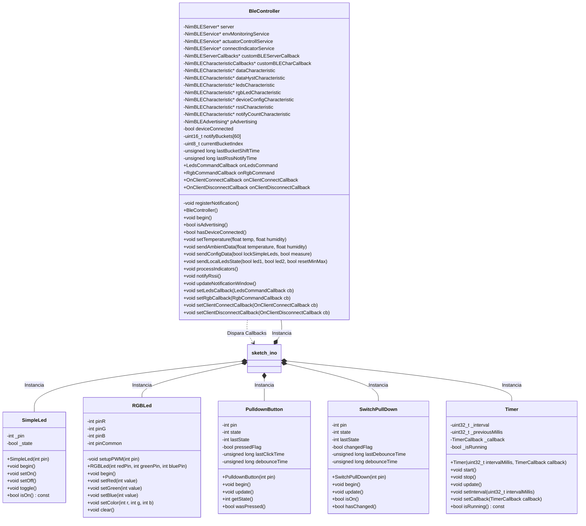
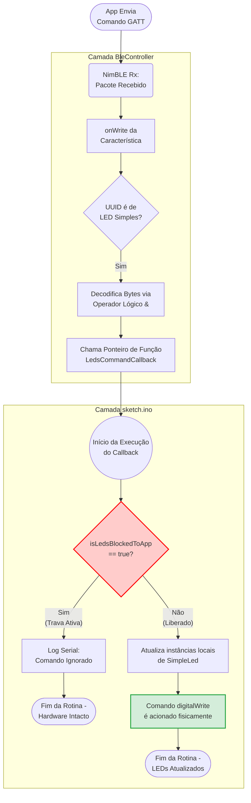

O projeto é estruturado da seguinte maneira: 
```
📦 raiz-do-repositorio
 ┣ 📂 bin/
 ┃ ┗ 📜 app-release.apk                   # Arquivo binário gerado para instalação no Android
 ┣ 📂 docs/                               # Documentação exigida pelo trabalho
 ┃ ┗ 📜 README.md                         # Documentação principal do projeto
 ┣ 📂 /apk/lib/                                # Código-fonte do aplicativo mobile (Flutter)
 ┃ ┣ 📂 screens/
 ┃ ┃ ┣ 📜 connection_metrics_section.dart # Painel de métricas de conexão, RSSI e contador de pacotes
 ┃ ┃ ┣ 📜 connection_screen.dart          # Tela de escaneamento BLE e pareamento seguro
 ┃ ┃ ┣ 📜 control_section.dart            # Painel de atuação (UX reativa para Leds Simples e RGB)
 ┃ ┃ ┣ 📜 dashboard_screen.dart           # Orquestrador de navegação, reconexão e ciclo de vida
 ┃ ┃ ┗ 📜 monitoring_section.dart         # Painel de gráficos e plotagem do histórico DHT22
 ┃ ┗ 📜 main.dart                         # Ponto de entrada e configuração do tema do aplicativo
 ┣ 📂 sketch/                             # Código-fonte do firmware embarcado (ESP32 / C++)
 ┃ ┣ 📜 BleController.cpp                 # Implementação das regras GATT, callbacks e segurança
 ┃ ┣ 📜 BleController.h                   # Header do controlador Bluetooth (NimBLE)
 ┃ ┣ 📜 PulldownButton.cpp                # Implementação de debounce e leitura para push-buttons
 ┃ ┣ 📜 PulldownButton.h                  # Header da classe de botões físicos
 ┃ ┣ 📜 RGBLed.cpp                        # Implementação das operações via PWM (ledc)
 ┃ ┣ 📜 RGBLed.h                          # Header do controlador do LED RGB
 ┃ ┣ 📜 SimpleLed.cpp                     # Implementação de métodos de toggle e estados lógicos
 ┃ ┣ 📜 SimpleLed.h                       # Header da classe de abstração de LEDs básicos
 ┃ ┣ 📜 SwitchPullDown.cpp                # Implementação do tratamento contínuo de switches
 ┃ ┣ 📜 SwitchPullDown.h                  # Header da classe de leitura de chaves estáticas
 ┃ ┣ 📜 Timer.cpp                         # Implementação da rotina não-bloqueante para tarefas
 ┃ ┣ 📜 Timer.h                           # Header do controlador de tempo via millis()
 ┃ ┗ 📜 sketch.ino                        # Arquivo principal (Máquina de estados, LCD e Orquestrador)
 ┗ 📜 README.md                           # Documentação central do projeto
```


# final da 2.1 Arquitetura do Firmware

O diagrama abaixo apresenta a estrutura das classes utilizadas no firmware.



Detalhes de implementação serão apresentados na seção [Descrição do Firmware](#3-descrição-do-firmware).


# final da 3.5. Gestão Assíncrona e Segurança (Callbacks)

O diagrama abaixo apresenta, como exemplo, o fluxo de execução dos comandos de controle dos leds simples, desde o recebimento dos comandos enviados pelo aplicativo até a reflexão das ordens nos atuadores em hardware. 

